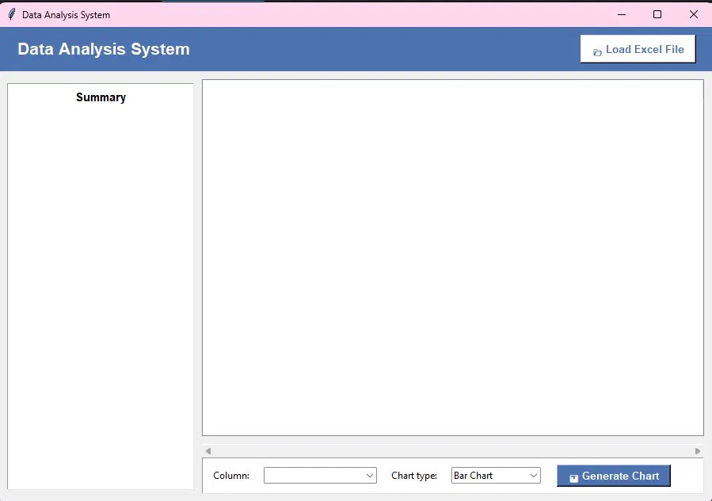
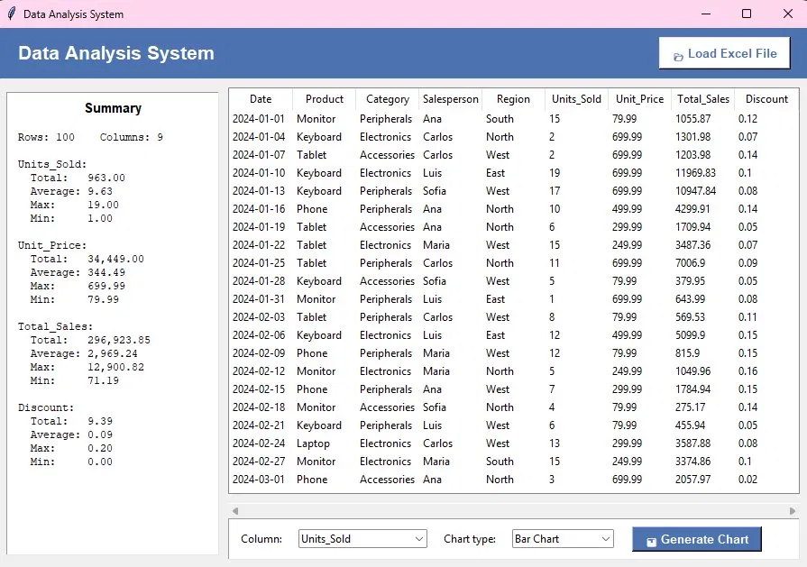
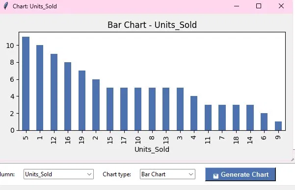
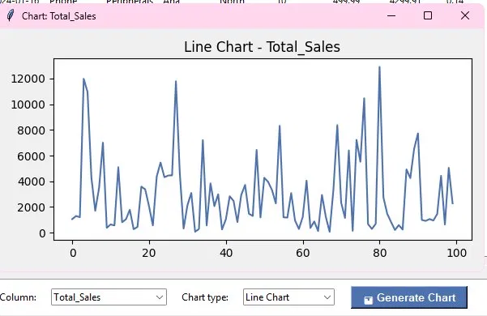
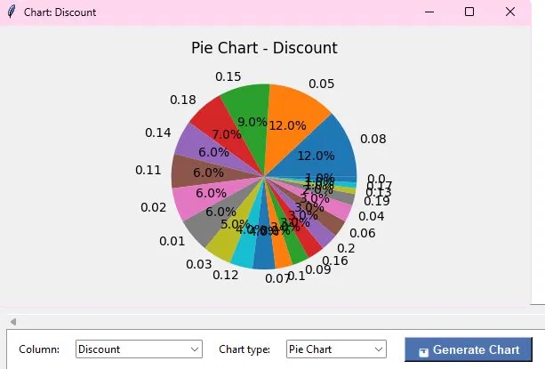

# Data Analysis System

A desktop application built with Python for loading, analyzing, and visualizing data from Excel files. The system features an interactive GUI that displays data summaries with key statistics and generates dynamic charts based on the selected dataset.

---

## Features

- Load any Excel file (.xlsx / .xls) with a single click
- Display data in an interactive table (up to 50 rows preview)
- Automatic summary with key statistics per numeric column:
  - Total, Average, Maximum, Minimum
- Generate dynamic charts:
  - Bar Chart
  - Line Chart
  - Pie Chart
- Column selector to choose which data to visualize
- Sample Excel file included for testing (`sales_data.xlsx`)

---

## Technologies Used

| Technology | Version |
|------------|---------|
| Python | 3.14.5 |
| Tkinter | Built-in |
| Pandas | Latest |
| Matplotlib | Latest |
| OpenPyXL | Latest |

---

## Prerequisites

Make sure you have the following installed before running the project:

- [Python 3.10+](https://www.python.org/downloads/)

---

## Installation & Run

1. Clone the repository:
```bash
git clone https://github.com/keybm24/Data_Analysis_System.git
```
2. Navigate to the project folder:
```bash
cd Data_Analysis_System
```
3. Install the required libraries:
```bash
pip install pandas matplotlib openpyxl
```
4. Run the application:
```bash
python main.py
```

---
## Usage

1. Launch the application with `python main.py`
2. Click **"Load Excel File"** and select any `.xlsx` file
3. The system will automatically display:
   - A data summary with statistics on the left panel
   - The data table on the right panel
4. Select a **column** from the dropdown to analyze
5. Select a **chart type** (Bar, Line, or Pie)
6. Click **"Generate Chart"** to visualize the data
7. A sample file `sales_data.xlsx` is included for testing

---

## Project Structure
```
Data_Analysis_System/
│
├── main.py              # Main application file (GUI + logic)
├── sales_data.xlsx      # Sample Excel file for testing
├── screenshots/         # Application screenshots
│   ├── main_screen.webp        # Empty application screen
│   ├── data_loaded.webp        # Application with data loaded
│   ├── bar_chart.webp          # Bar chart example
│   ├── line_chart_price.webp   # Line chart - unit price
│   ├── line_chart_sales.webp   # Line chart - total sales
│   └── pie_chart.webp          # Pie chart example
└── README.md            # Project documentation
```

---

## Screenshots

| Main Screen | Data Loaded |
|---|---|
|  |  |

| Bar Chart | Line Chart |
|---|---|
|  |  |

| Pie Chart |
|---|
|  |

---

## Author

**Keilyn Barrantes Mora**  
keybarmor24@gmail.com  
[LinkedIn](https://www.linkedin.com/in/keybarrantes242003/)  
[GitHub](https://github.com/keybm24)
